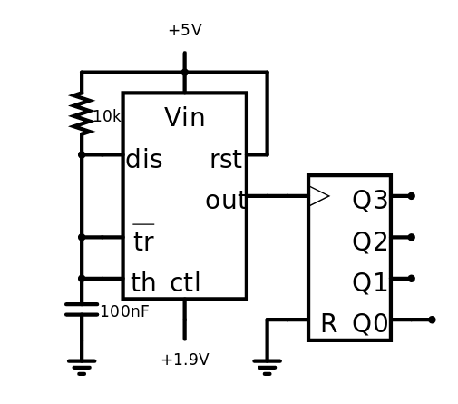
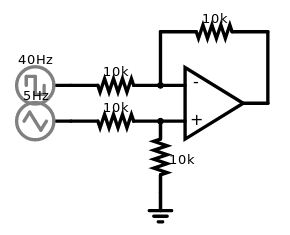
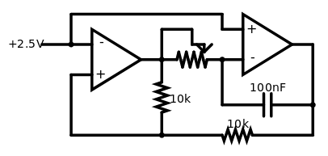
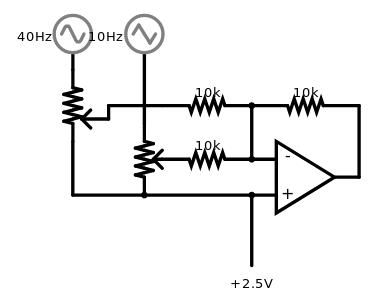

# Simple Analog Modular Lunetta Synth

This repository contains components of an easy to build analog, modular lunetta-synth with a claim on simplicity. It consists of easy to understand, customizable and extendable components. These components are

| Component | Schematic |
|:-----:|:-----:|
|VCO||
|VCA||
|LFO||
|MIXER||
|VCF|coming soon...|

The single circuits are described in their respective folders and there is a link to the simulation.

## Design 
The components can operate with single supply voltages and are designed to be very cost efficient. They use mainly 10k resistors, 100n capacitors, common op-amps and NE555 timers. Additionately they can be built very efficiently. E.g. you can build 2 vcos from a NE556 chip or a quad vca from an LM324. 
The circuits are not temperature compensated and don't respect interfaces like volts per octave.

In the example I use a supply voltage of 5V. For some of the components a voltage of half of the difference of the supply voltages is needed. So in this case it's 2.5V.

## Extendability
Since it is a lunetta synth that operates on single supply you can integrate logic gates very easily. E.g. use an exor gate to create a ring modulator or try other chips for uncommon results. There are more components to come. Ideas of filter is very welcome (link to issue) (a integrator filter would be nice). In the future I will add more lunetta style modules.

## Questions and issues
Please file questions and issues so I can incrementally build up this repository.
