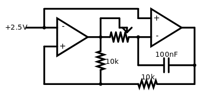

# LFO

The LFO combines an integrator and a comparator with hyteresis to produce a square and a triangle wave. The input of the left op-amp is connected to a voltage of half of the differences of the supply voltages.

[Simulation](http://www.falstad.com/circuit/circuitjs.html?cct=$+4+0.000005+54.00526672067058+50+5+43%0Aa+-208+128+-112+128+8+5+0+1000000+2.5+4.215875608756964+100000%0Aa+-48+112+48+112+9+5+0+1000000+2.4999656842036506+2.5+100000%0Ar+-112+128+-112+208+0+10000%0Ar+-112+208+48+208+0+10000%0A174+-112+128+-48+128+0+1000000+0.8960000000000001+Resistance%0Aw+-112+128+-112+96+0%0Aw+-112+96+-80+96+0%0Aw+-80+96+-80+112+0%0Aw+-208+112+-208+80+0%0Aw+-48+96+-48+80+0%0Aw+-48+80+-208+80+0%0Ac+-48+176+48+176+0+1.0000000000000001e-7+-0.9316139507494023%0Aw+48+112+48+176+0%0Aw+-48+176+-48+128+0%0Aw+48+176+48+208+0%0Aw+-208+144+-208+208+0%0Aw+-208+208+-112+208+0%0AR+-208+112+-256+112+0+0+40+2.5+0+0+0.5%0A)