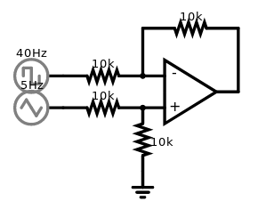

# VCA

The VCA is a simple operational amplifier that operates in saturation mode. It is a little bit hacky but with a distinctive character. Voltages under/over the supply voltages of the op-amp simply get cut off. You get the full input signal at [equation](https://latex.codecogs.com/gif.latex?%5Cfrac%7BV_%7B&plus;%7D-V_%7B-%7D%7D%7B2%7D). You can use an attenuator to condition the input signal to be more linear.

