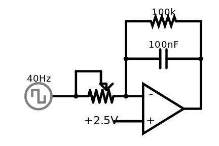

# VCF

This component is tbd. The preview shows a manual controlled differentiator. This needs to be modified to be voltage controlled.

[Simulation](http://www.falstad.com/circuit/circuitjs.html?cct=$+5+0.0000049999999999999996+96.77753655846766+50+5+50%0Aa+-112+48+-16+48+8+5+0+1000000+2.4999616076545004+2.5+100000%0AR+-112+64+-144+64+0+0+40+2.5+0+0+0.5%0Aw+-16+48+-16+-16+0%0Aw+-112+32+-112+-16+0%0AR+-176+32+-224+32+0+2+40+2.5+2.5+0+0.5%0Ac+-16+-16+-112+-16+0+1.0000000000000001e-7+1.3392729422955352%0A174+-176+32+-112+32+0+100000+0.7376+Resistance%0Aw+-176+32+-176+0+0%0Aw+-176+0+-144+0+0%0Aw+-144+0+-144+16+0%0Ar+-112+-64+-16+-64+0+100000%0Aw+-112+-64+-112+-16+0%0Aw+-16+-16+-16+-64+0%0Ao+2+64+0+4098+20+0.0001953125+0+2+2+3%0A)
