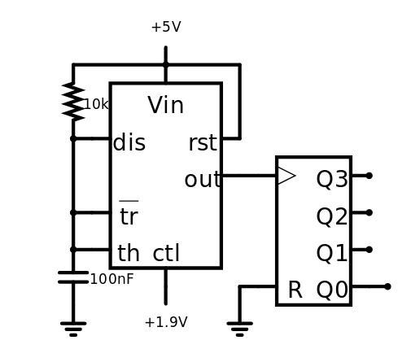

# VCO

The VCO consists of a simple NE555 circuit that is able to modulate the frequency and the pulse width of a square wave via a reference voltage. The output is connected to a simple binary counter to compensate the varying duty-cycle. As a nice side effect you can get different octaves of the signal from the different counter outputs. Additionately you can use the reset input of the counter and/or the NE555 to create a sync effect.

The impedance of the cv input is only ~5kOhm. It's best to use an impedance converter on the input.

[Simulation](http://www.falstad.com/circuit/circuitjs.html?cct=$+5+0.0000049999999999999996+63.79968419005069+50+5+50%0A165+-192+48+-128+48+2+4.999999950000001%0AR+-128+16+-128+-16+0+0+40+5+0+0+0.5%0Ac+-208+176+-208+224+0+1.0000000000000001e-7+1.7519370611976415%0Ag+-208+224+-208+240+0%0Aw+-208+176+-192+176+0%0Aw+-208+176+-208+144+0%0Aw+-208+144+-192+144+0%0Aw+-192+80+-208+80+0%0Aw+-128+16+-208+16+0%0Aw+-64+80+-64+16+0%0Aw+-64+16+-128+16+0%0Aw+-64+112+-48+112+0%0A164+-48+112+0+112+0+4+5+5+5+5+false%0A172+-128+208+-128+240+0+7+1.9+5+0+0+0.5+Voltage%0Aw+48+208+64+208+0%0Aw+-208+80+-208+144+0%0Ar+-208+16+-208+80+0+10000%0Aw+-64+208+-48+208+0%0Ag+-64+208+-64+240+0%0Ao+14+64+0+4099+5+0.00009765625+0+2+14+3%0A)